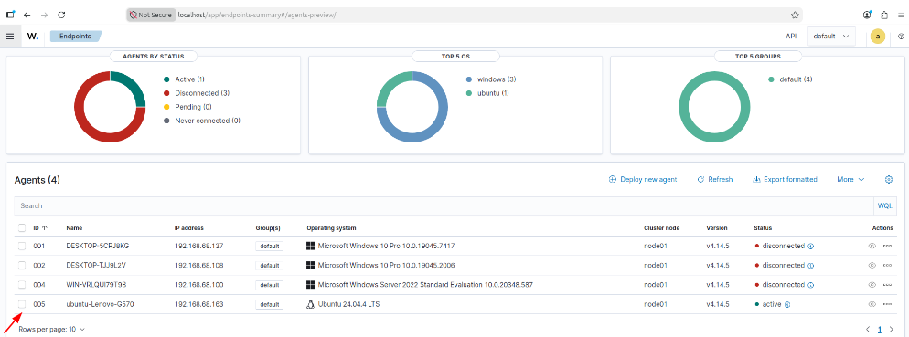

# Lab 01: Wazuh SIEM Architecture & Multi-Platform Agent Deployment

## Overview
This module establishes the core host-based security monitoring architecture using Wazuh. The environment coordinates telemetry collection across Windows Server endpoints and Ubuntu Linux targets, shipping encrypted logs to a centralized Wazuh Server and Indexer.

```text
+-------------------------------------------------------------------------------+
|                             Wazuh Architecture                                |
+-------------------------------------------------------------------------------+
|                                                                               |
|  [ Windows Server Endpoint ]                 [ Ubuntu Target Host ]           |
|      (ossec-agent)                               (wazuh-agent)                |
|   - Windows Security Events                   - Systemd Journald Logs         |
|   - FIM (Whodata / Registry)                  - Apache/XAMPP Access Logs      |
|   - OpenSSH Operational Logs                  - MariaDB Query Log             |
|            \                                         /                        |
|             \                                       /                         |
|              +------------------+------------------+                          |
|                                 |                                             |
|                                 | TCP Port 1514 (Encrypted Log Stream)        |
|                                 v                                             |
|                     +-----------------------+                                 |
|                     |     Wazuh Server      | (Analysis Engine, Rules,        |
|                     |    (Linux Host)       |  Decoders, Active Response)     |
|                     +-----------+-----------+                                 |
|                                 |                                             |
|                                 v                                             |
|                     +-----------------------+                                 |
|                     |     Wazuh Indexer     | (OpenSearch Analytics Store)    |
|                     +-----------+-----------+                                 |
|                                 |                                             |
|                                 v                                             |
|                     +-----------------------+                                 |
|                     |    Wazuh Dashboard    | (Threat Hunting & Alerts UI)    |
|                     +-----------------------+                                 |
+-------------------------------------------------------------------------------+
```

---

## 1. Component Roles & Topology
* **Wazuh Agent (Target Nodes):** Runs as a background service (`wazuh-agent`) on Windows and Ubuntu targets. Collects security events, monitors file system hooks, and forwards data securely via port 1514.
* **Wazuh Server (Detection Brain):** Ingests raw events, passes them through decoders for field extraction, and matches them against detection rules.
* **Wazuh Indexer (Search Engine):** Stores and indexes security alerts in an OpenSearch-based database.
* **Wazuh Dashboard (Visualization Window):** Web interface for querying telemetry and conducting investigations.

---

## 2. Agent Configuration Engineering

### A. Client Connection Definition (`ossec.conf`)
On target hosts, the agent's forwarding destination is declared in `ossec.conf`:

```xml
<client>
  <server>
    <address>YOUR_LINUX_MINT_IP_HERE</address>
    <port>1514</port>
    <protocol>tcp</protocol>
  </server>
</client>
```

### B. Event Log Channel Harvesting
Configured to collect critical OS-level authentication and system streams:

```xml
<localfile>
  <location>Security</location>
  <log_format>eventlog</log_format>
</localfile>
```

### C. Centralized Multi-Node Group Management (`agent.conf`)
Managed configuration changes centrally from `/var/ossec/etc/shared/default/agent.conf` on the Wazuh Server to push policies automatically across endpoint groups without requiring manual file edits on endpoints.

---

## 3. Deployment Validation

Verified active status and telemetry ingestion across all registered endpoints in the Wazuh UI:


