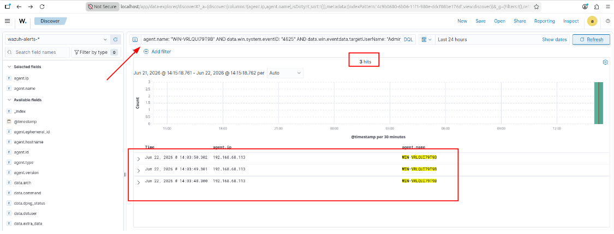
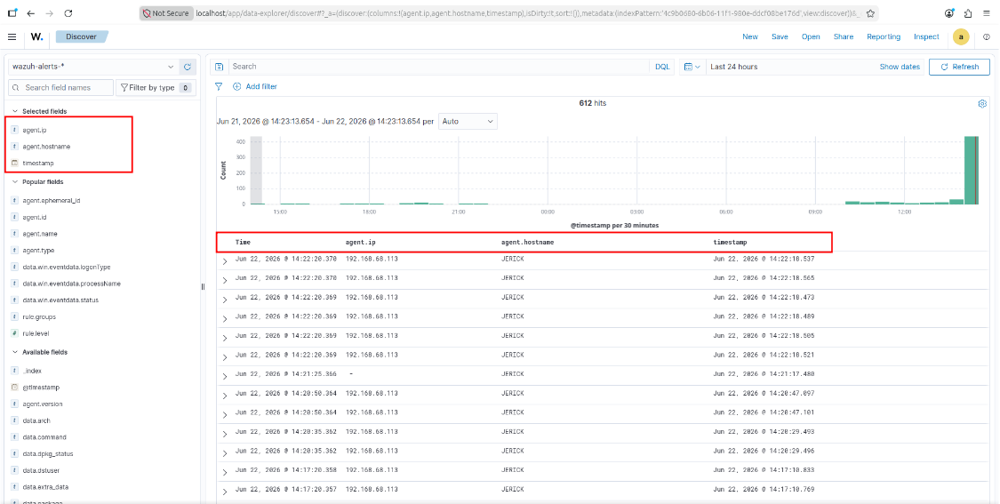

# Lab 02: Dashboard Navigation & KQL Threat Hunting Mastery

## Overview
This module focuses on log parsing, alert anatomy, and threat hunting using Kibana Query Language (KQL) within the Wazuh Dashboard. Analysts filter out background telemetry noise to reconstruct attack timelines.

---

## 1. Anatomy of an Indexed Alert
Every event ingested by Wazuh is parsed into structured fields:

| Field | SOC Significance | Lab Example |
|---|---|---|
| `agent.name` / `agent.id` | Source endpoint asset identifier | `WIN-VRLOUIST` / `001` |
| `rule.id` | Wazuh signature identification | `60122` (Logon Success), `100003` (SQLi)[cite: 2] |
| `rule.level` | Threat severity scale (0–15)[cite: 2] | `3` (Low), `10` (High), `12+` (Critical)[cite: 2] |
| `data.win.system.eventID` | Windows Security Event ID[cite: 2] | `4625` (Failed Logon), `4624` (Success)[cite: 2] |
| `data.win.eventdata.targetUserName` | Targeted identity / account[cite: 2] | `Administrator`[cite: 2] |

---

## 2. Threat Hunting via Advanced KQL Queries

### A. Targeting Specific Endpoints
Isolating telemetry to a single compromised or monitored machine[cite: 2]:
```kql
agent.name: "WIN-VRLOUIST"
```

### B. Detecting Targeted Credential Attacks
Query to identify multiple failed password attempts directed against the built-in Administrator account[cite: 2]:
```kql
agent.name: "WIN-VRLOUIST" AND data.win.system.eventID: "4625" AND data.win.eventdata.targetUserName: "Administrator"
```


*(Verified 3 failed login attempts captured and correlated in real-time)*[cite: 2]

### C. Severity-Based Noise Reduction
Excluding low-priority audit chatter to focus solely on high-severity events across the network[cite: 2]:
```kql
rule.level >= 10
```

---

## 3. Custom SOC Analyst Table Layout
To maintain situational awareness during triage, standard raw JSON payloads were converted into tabular views by pinning selected fields[cite: 2]:
* `agent.name`[cite: 2]
* `data.win.eventdata.targetUserName`[cite: 2]
* `data.win.system.eventID`[cite: 2]
* `rule.description`[cite: 2]


