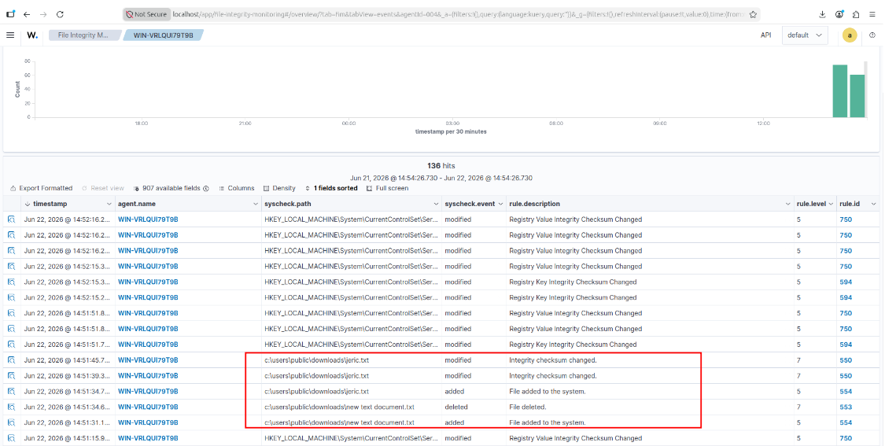
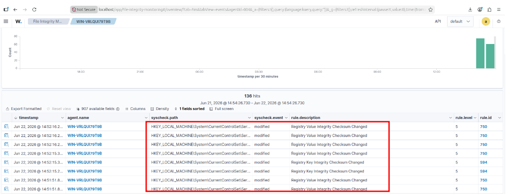

# Lab 03: File Integrity Monitoring & Windows Registry Auditing

## Overview
Wazuh File Integrity Monitoring (FIM / `syscheck`) tracks unauthorized additions, modifications, and deletions across sensitive filesystem directories and Windows Registry persistence keys.

---

## 1. FIM Operational Engine
FIM combines two distinct mechanisms:
* **Cryptographic Baseline Audits:** Periodic scans compute and store MD5, SHA-1, and SHA-256 hashes of system binaries and configuration files.
* **Real-Time Kernel Notifications:** Integrates with Windows `ReadDirectoryChangesW` to trigger immediate alerts upon filesystem modifications.

---

## 2. Configuration (`ossec.conf`)

### A. Critical Directory & Real-Time Monitoring
Configured inside the `<syscheck>` block:

```xml
<syscheck>
  <frequency>10</frequency>
  <directories realtime="yes" check_all="yes">C:\Windows\System32\drivers\etc</directories>
  <directories realtime="yes" check_all="yes">C:\Users\Public\Downloads</directories>
</syscheck>
```

### B. Monitoring Persistence Registry Keys
Monitors common persistence locations such as `Run` keys:
```xml
<registry_key realtime="yes">HKEY_LOCAL_MACHINE\Software\Microsoft\Windows\CurrentVersion\Run</registry_key>
```

### C. Whodata Auditing (Who Modified the File?)
Configured with `whodata="yes"` to leverage Windows SACLs and Security Event ID 4663, capturing the user (`syscheck.uname`) and process (`syscheck.proc_name`) responsible for the change:
```xml
<directories whodata="yes">C:\SensitiveData</directories>
```

---

## 3. Simulation & Verification

1. Created test files (`new text document.txt`) within the monitored `Public\Downloads` directory.
2. Verified detection of file additions and checksum changes in the Wazuh UI:



