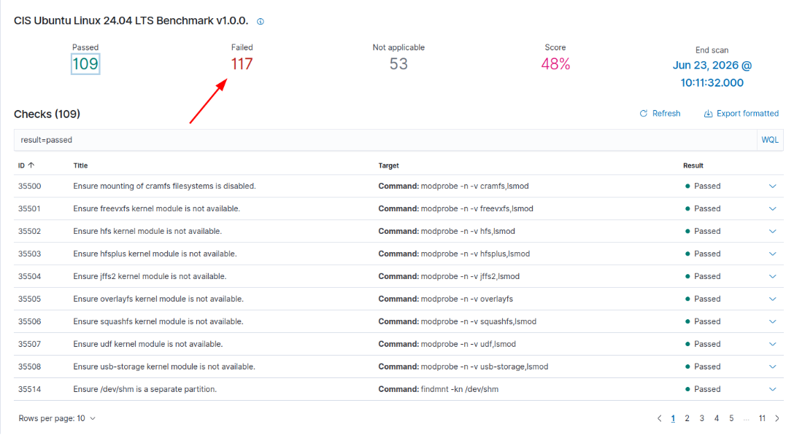
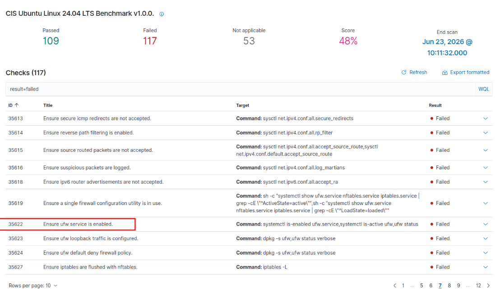
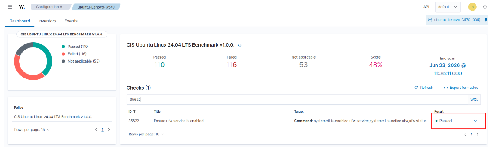

# Lab 04: Security Configuration Assessment (SCA) & CIS Hardening

## Overview
Wazuh SCA audits endpoints against Center for Internet Security (CIS) benchmarks to identify insecure defaults, missing controls, and vulnerable system settings.

---

## 1. CIS Benchmark Scan Execution
The Ubuntu 24.04 LTS target endpoint was evaluated against `CIS Ubuntu Linux 24.04 LTS Benchmark v1.0.0`.

Initial Audit Results:
* **Passed Checks:** 109
* **Failed Checks:** 117
* **Overall Compliance Score:** 48%



---

## 2. Vulnerability Identification: Uncomplicated Firewall (UFW)
Review of failed rules identified non-compliance on firewall enforcement:
* **Check ID:** `35622`
* **Title:** Ensure ufw service is enabled
* **Status:** Failed
* **Compliance Frameworks:** CIS 4.2.3, ISO 27001 A.13.1.1, MITRE ATT&CK T1562 (Impair Defenses)



---

## 3. Remediation & Verification

Executed remediation commands on the target host:
```bash
sudo systemctl unmask ufw.service
sudo systemctl --now enable ufw.service
sudo ufw enable
sudo systemctl restart wazuh-agent
```

After rescanning, Rule `35622` passed and the compliance status was updated:


