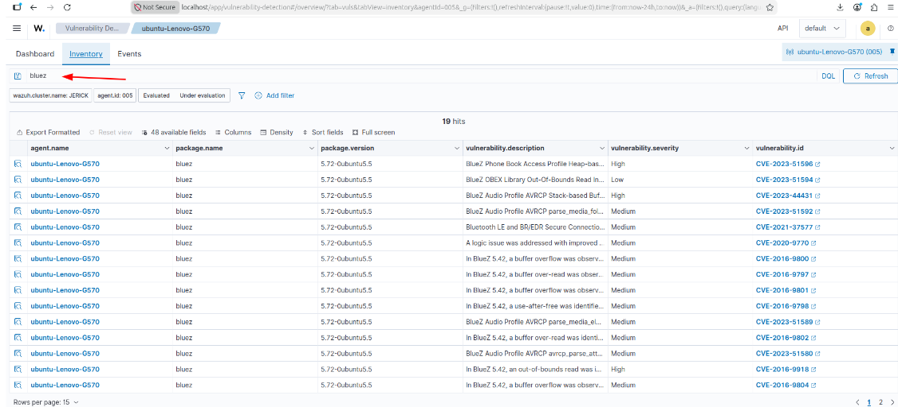
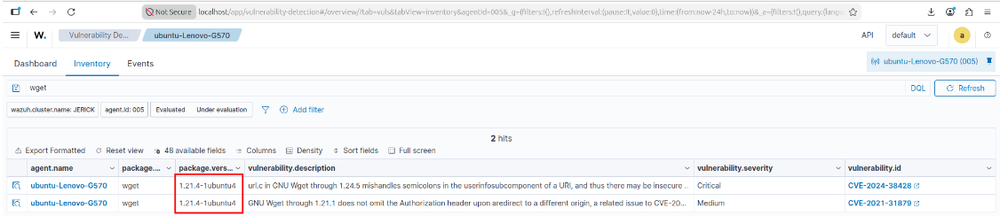
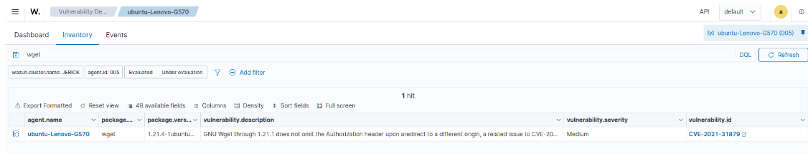

# Lab 05: Vulnerability Detection & Package Remediation Lifecycle

## Overview
Wazuh cross-references installed package inventories against Canonical CVE Trackers and the National Vulnerability Database (NVD) to alert on known software flaws.

---

## 1. Initial Vulnerability Discovery (BlueZ)
Inventory scanning surfaced 19 active CVEs associated with the `bluez` package (version `5.72-0ubuntu5.5`), including remote code execution flaw `CVE-2023-51596`.

Attempted upgrade via package management:
```bash
sudo apt update && sudo apt install --only-upgrade bluez -y
```
Because `5.72-0ubuntu5.5` was already the latest build provided in the standard distribution repositories, the vulnerability remained unpatched, demonstrating a real-world upstream patch delay.



---

## 2. Vulnerability Lifecycle Emulation (Downgrade & Patch: `wget`)

To model the full vulnerability lifecycle, a vulnerable version of `wget` was introduced:

```bash
# Force package downgrade
sudo apt install wget=1.21.4-1ubuntu4 -y --allow-downgrades
sudo systemctl restart wazuh-agent
```

Wazuh flagged 2 active vulnerabilities on the downgraded binary:
* **CVE-2024-34428** (Critical)
* **CVE-2021-31879** (Medium)



---

## 3. Remediation & Vulnerability Clearance

Applied the vendor security patch:
```bash
sudo apt update && sudo apt install --only-upgrade wget -y
sudo systemctl restart wazuh-agent
```

After updating, the critical flaw (`CVE-2024-34428`) was cleared from the active vulnerability inventory:


