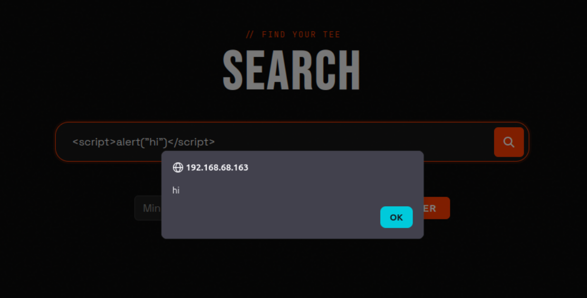
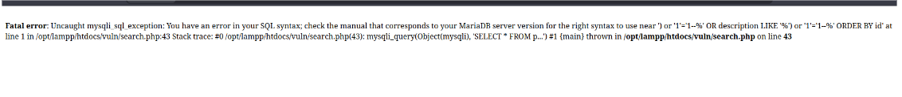
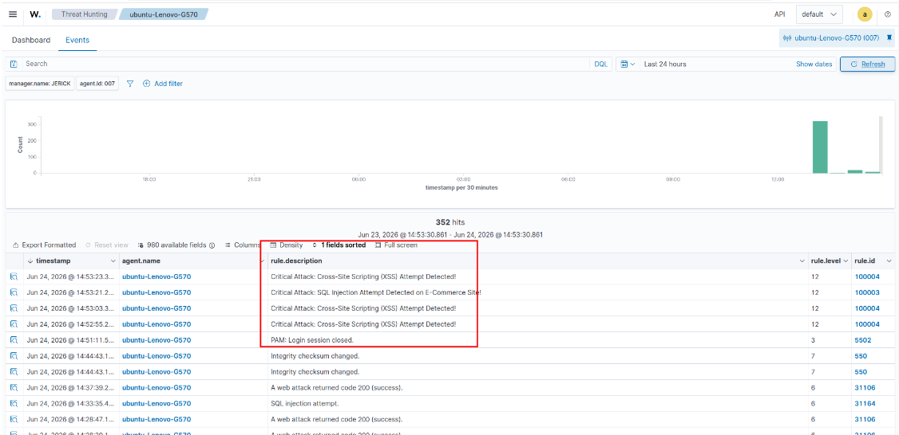
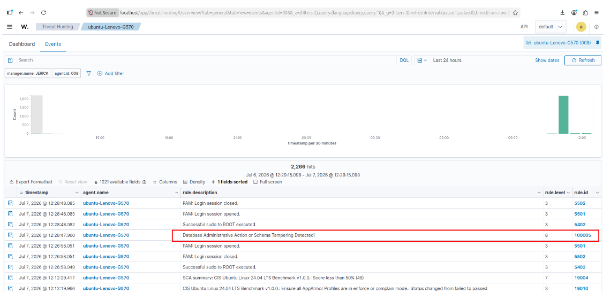

# Lab 06: Custom Log Decoders & Web Attack Detection

## Overview
This module expands Wazuh beyond default system logs by monitoring XAMPP/Apache web server logs and writing custom detection rules for SQL Injection (SQLi), Cross-Site Scripting (XSS), and database tampering[cite: 2].

---

## 1. Log Ingestion Configuration (`ossec.conf`)
Added local log ingestion blocks on the Ubuntu target[cite: 2]:

```xml
<!-- Apache Access Logs -->
<localfile>
  <location>/opt/lampp/logs/access_log</location>
  <log_format>syslog</log_format>
</localfile>

<!-- MariaDB Query Audit Logs -->
<localfile>
  <location>/opt/lampp/var/mysql/mysql_query.log</location>
  <log_format>syslog</log_format>
</localfile>
```

---

## 2. Custom Detection Rules (`local_rules.xml`)
Configured in `/var/ossec/etc/rules/local_rules.xml` on the Wazuh Server[cite: 2]:

```xml
<group name="web_attack,">
  <!-- Rule 100003: SQL Injection -->
  <rule id="100003" level="12">
    <if_sid>31106, 31164</if_sid>
    <match>SELECT|UNION|OR 1=1|--|union select</match>
    <description>Critical Attack: SQL Injection Attempt Detected on E-Commerce Site!</description>
    <group>web_attack,sqli</group>
  </rule>

  <!-- Rule 100004: Cross-Site Scripting (XSS) -->
  <rule id="100004" level="12">
    <if_sid>31106, 31164</if_sid>
    <match>&lt;script|alert\(|javascript:|%3Cscript</match>
    <description>Critical Attack: Cross-Site Scripting (XSS) Attempt Detected!</description>
    <group>web_attack,xss</group>
  </rule>

  <!-- Rule 100005: Database Schema Tampering -->
  <rule id="100005" level="8">
    <match>DROP DATABASE|DROP TABLE|ALTER TABLE|GRANT ALL</match>
    <description>Database Administrative Action or Schema Tampering Detected!</description>
    <group>database,audit</group>
  </rule>
</group>
```

---

## 3. Attack Simulation & Rule Triggers

### A. Web Application Attack Simulation
Injected payloads via the web application search form[cite: 2]:
* **XSS:** `<script>alert("hi")</script>`[cite: 2]
* **SQLi:** `') or '1'='1--`[cite: 2]




Both attacks triggered alerts matching Rules `100003` and `100004`[cite: 2]:



### B. Database Tampering Simulation
Simulated unauthorized database removal[cite: 2]:
```bash
sudo /opt/lampp/bin/mysql -u root -e "DROP DATABASE wazuh_test_db;"
```

Triggered Rule `100005`:


