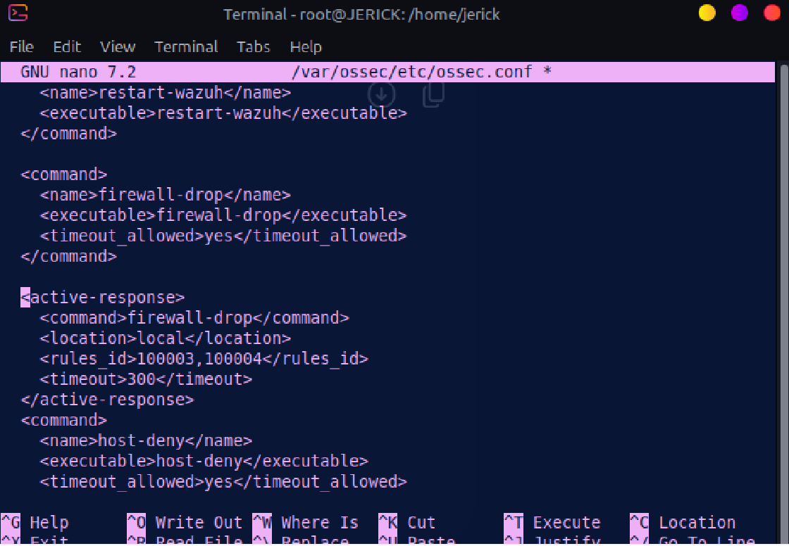
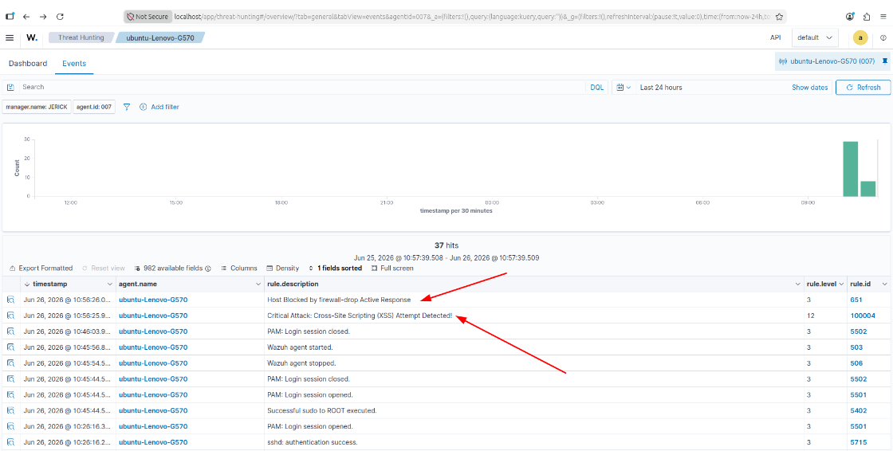
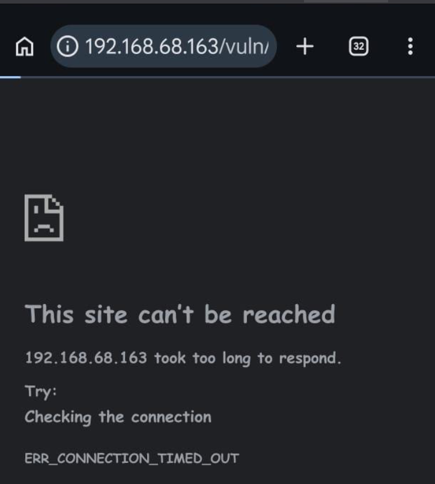
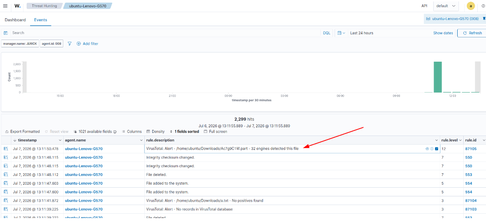

# Lab 07: Automated Active Response & Threat Intelligence Integration

## Overview
This module configures automated incident containment using Wazuh Active Response to block attacking IPs, alongside VirusTotal threat intelligence integration for automated file-reputation analysis[cite: 2].

---

## 1. Automated Active Response (`firewall-drop`)

### Configuration (`/var/ossec/etc/ossec.conf`)
Configured on the Wazuh Server to invoke `firewall-drop` via `iptables` whenever web attack rules (`100003` or `100004`) trigger, blocking the offending IP for 300 seconds[cite: 2]:

```xml
<command>
  <name>firewall-drop</name>
  <executable>firewall-drop</executable>
  <timeout_allowed>yes</timeout_allowed>
</command>

<active-response>
  <command>firewall-drop</command>
  <location>local</location>
  <rules_id>100003, 100004</rules_id>
  <timeout>300</timeout>
</active-response>
```



---

## 2. Active Response Validation

1. An attack payload was sent from an external client (mobile device on the local network)[cite: 2].
2. Rule `100004` fired, triggering Active Response[cite: 2].
3. The firewall dynamically dropped packets from the client IP, resulting in a connection timeout (`ERR_CONNECTION_TIMED_OUT`)[cite: 2].
4. After 300 seconds, Wazuh unblocked the IP[cite: 2].




---

## 3. VirusTotal Threat Intelligence Integration

### Configuration (`ossec.conf`)
Integrated the VirusTotal API on the Wazuh Server to query file hashes generated by FIM in the `/home/ubuntu/Downloads` directory[cite: 2]:

```xml
<integration>
  <name>virustotal</name>
  <api_key>YOUR_VIRUSTOTAL_API_KEY</api_key>
  <rule_id>100010</rule_id>
  <alert_format>json</alert_format>
</integration>
```

When a binary is dropped into the monitored folder, Wazuh queries VirusTotal to assess file reputation[cite: 2]:


